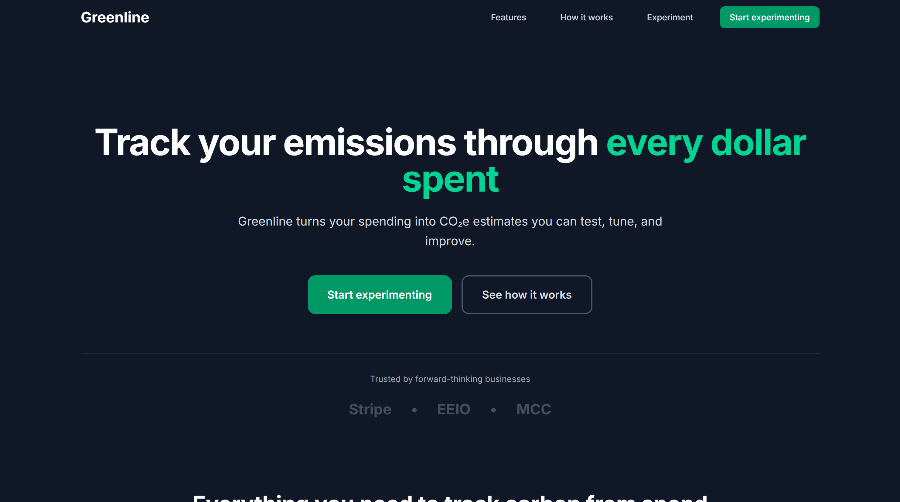
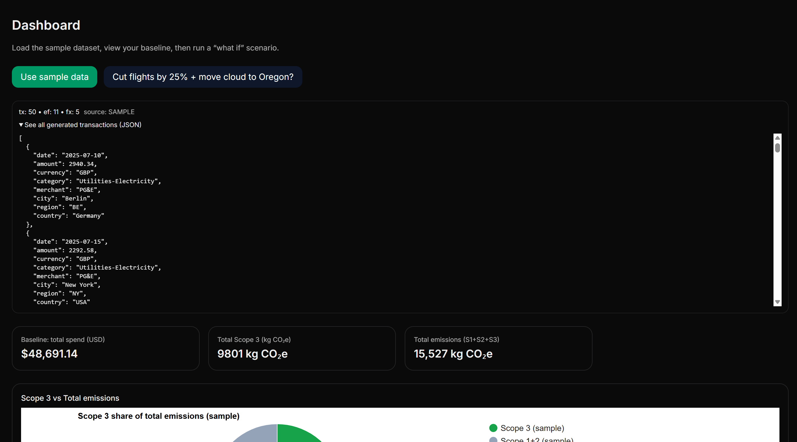
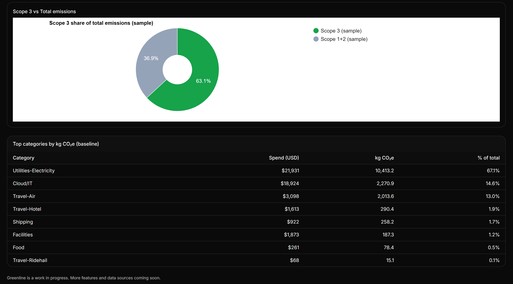

# 🌿 Greenline

> **Carbon analytics made actionable.**  
> Greenline translates business transactions into real-time CO₂ emissions insights - helping companies visualize, understand, and reduce their environmental impact.

---

## 🚀 Overview

Greenline is a **B2B sustainability analytics platform** that estimates and visualizes a business’s carbon footprint directly from its financial data.  
Using **Stripe Issuing**, simulated transactions are mapped to **merchant category codes (MCCs)** and paired with **EEIO emissions factors** to deliver automated, accurate, and scalable carbon insights.

---

## 🧠 Core Features

- 🌍 **Automated Emissions Calculations**  
  Translates transactions across 100+ merchant categories into CO₂ equivalents for sustainability reporting.

- 📊 **Dynamic Carbon Dashboard**  
  Visualizes total emissions, category breakdowns, and month-over-month impact.

- 🧩 **Experiment Mode**  
  Simulate business changes - like switching suppliers or reducing travel — and see how emissions shift instantly.

- 💳 **Simulated Bank Accounts**  
  Uses **Stripe Issuing (test mode)** to generate transaction streams from imaginary businesses for prototyping and analysis.

---

## 🛠️ Tech Stack

| Layer | Technologies |
|-------|---------------|
| **Frontend** | Next.js, Typescript, TailwindCSS |
| **APIs & Integrations** | Stripe Issuing and Retrieving API, EEIO Dataset  |
| **Infrastructure (MVP)** | _Deployment coming soon!_ |

---

## 🖼️ Screenshots

### 🪩 Landing Page

---

### 📊 Dashboard and Entries

---

### 🌎 Emission Breakdown and Spend Analysis

---

## 📚 How It Works

1. **Simulated Transactions**  
   Stripe Issuing creates realistic transactions tagged with MCC codes.

2. **Category Matching**  
   Each transaction category maps to an EEIO sector’s emissions factor.

3. **Emissions Calculation**  
   Emissions = *Transaction Amount × Emission Factor (kg CO₂e / USD)*
   _- occassionally, a weight will be applied to the emission amount in case of scenario selection_
5. **Visualization**  
   Data is aggregated into an interactive dashboard with filtering and scenario tools.

---

## 💡 Future Plans

- Develop **automated sustainability reporting exports** and generate B2B revenue 
- Integrate **live bank connections** (e.g., Plaid) for real financial data  
- Add **AI-driven emissions recommendations**  
- Build **benchmark comparisons** by industry and region  

---

## 🧑‍💻 Authors

**Ardi Ahmed, ** **Adam Khadre, ** **Junna Park **  
Founders of Greenline, HackOHI/O '25  
The Ohio State University - Computer Science & Engineering  
https://linkedin.com/in/ardiahmed1
https://github.com/ardiahm

---

## 🪶 All Rights Reserved 

Greenline - All Rights Reserved

---

> _“You can’t manage what you don’t measure — Greenline helps businesses do both.”_
